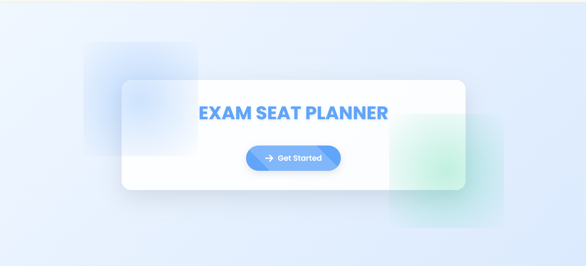
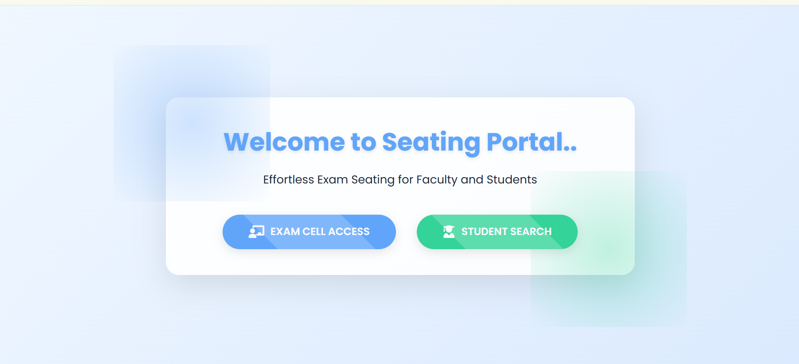
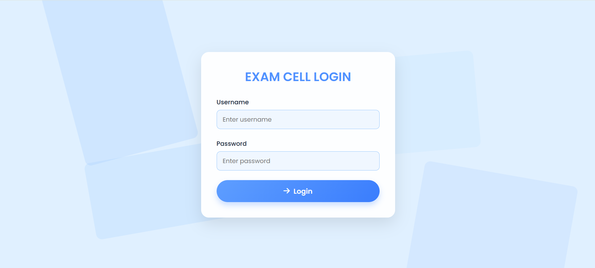
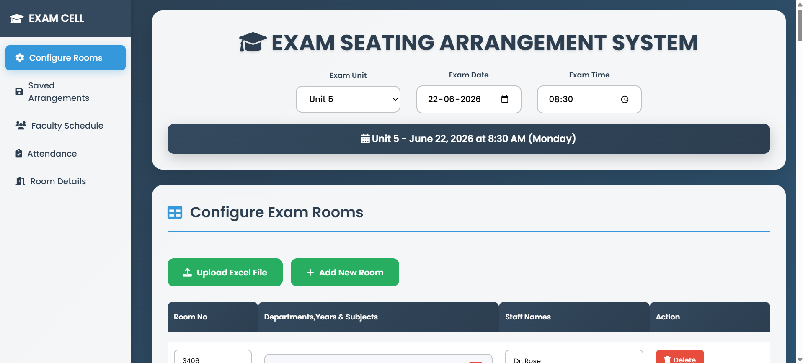
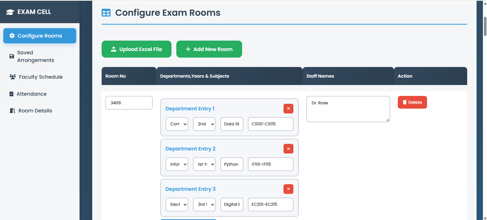
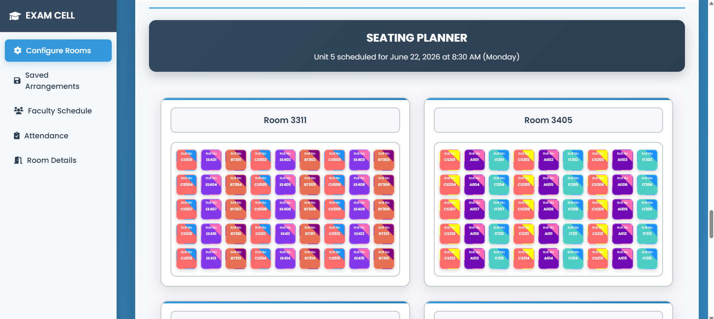
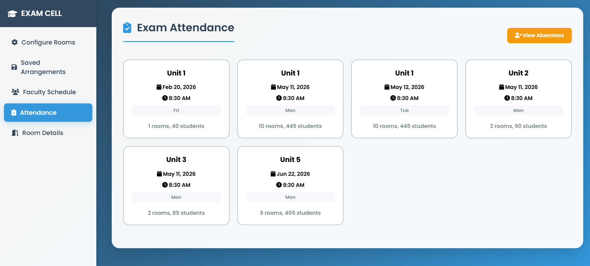
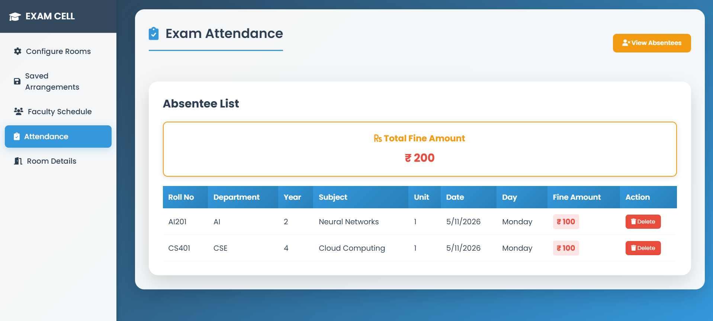
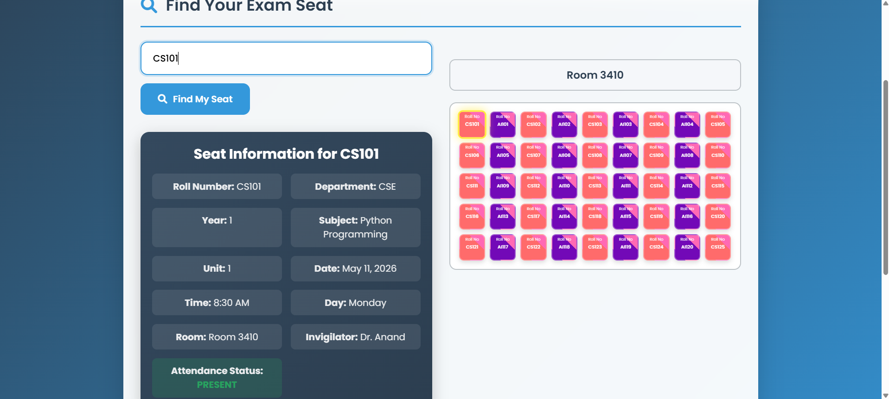
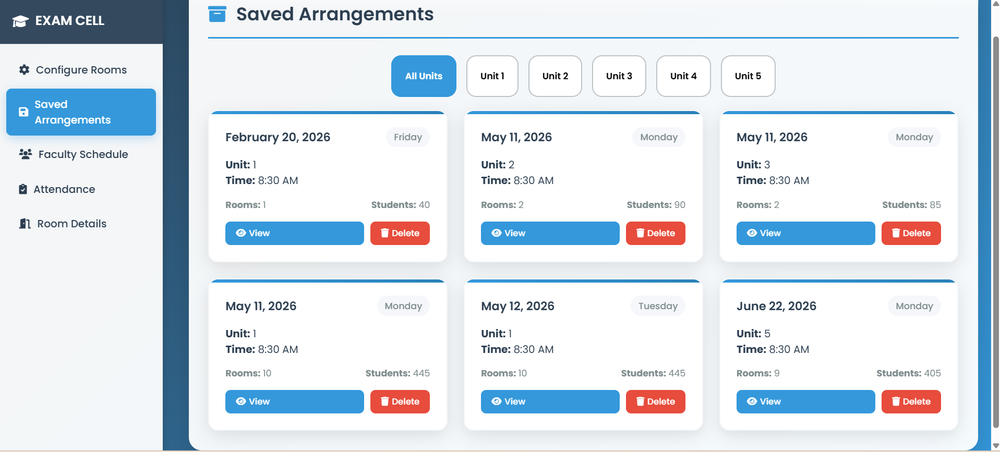

# 🎓 Automated Exam Seating Arrangement System

<div align="center">


**A modern, responsive web application built with HTML5, CSS3, and JavaScript (ES6+) to simplify and automate exam hall seating allocation, attendance tracking, and student seat inquiry.**

</div>

---

## 📌 Overview

Managing exam seating arrangements manually can be time-consuming, prone to errors, and challenging when organizing multiple departments and examination halls. The **Automated Exam Seating Arrangement System** provides an end-to-end digital workflow for:
- **Exam Cell Administrators & Faculty**: Configuring exam halls, assigning students systematically to avoid malpractices, taking attendance, and recording absentees.
- **Students**: Searching and locating their assigned exam halls, row, and seat number effortlessly.

---

## 🛠️ Built With (Technologies Used)

This application is built from scratch using pure frontend web technologies:

| Technology | Role & Implementation Details |
| :--- | :--- |
|  **HTML5** | • Structured semantic markup across all portals (`home`, `dashboard`, `login`, `faculty`, `student`).<br>• Dynamic containers for room layouts, student input tables, and absentee reports.<br>• Clean form elements and navigation anchors. |
|  **CSS3** | • **Glassmorphism & Gradients**: Sleek card designs with backdrop filters and pastel gradient backgrounds.<br>• **Responsive Layouts**: Flexbox and CSS Grid for adaptable multi-device screen scaling.<br>• **Micro-animations**: Smooth hover transitions, shimmer button effects, and `@keyframes` entrance animations (`fadeInDown`, `fadeIn`). |
|  **JavaScript (ES6+)** | • **Seating Algorithm**: Computes student seat distribution across rooms and bench layouts dynamically.<br>• **Visual Grid Rendering**: Programmatically creates interactive hall and bench representations in the DOM.<br>• **Attendance & Absentee Tracker**: Real-time attendance toggling, absentee list generation, and state handling.<br>• **Student Lookup**: Fast search query matching for student roll numbers and assigned seat details.<br>• **Storage & State**: Saves generated arrangements and configurations locally in the browser. |
|  **Font Awesome & Google Fonts** | Modern icon sets and Google Poppins typography for an intuitive and clean user experience. |

---

## ✨ Key Features

- **🏛️ Interactive Landing & Navigation Portal**: Seamless entry points tailored for students and exam cell personnel.
- **🔐 Secure Exam Cell Access**: Role-based login for authorized staff and invigilators.
- **⚙️ Hall & Room Configuration**: Customize room capacities, bench layouts, rows, and columns dynamically.
- **💺 Intelligent Seating Allocation**: Automated assignment of students across available rooms and benches.
- **🗺️ Visual Hall Layout**: Graphical bench-by-bench visualization of student seating allocations.
- **📋 Real-time Attendance & Absentee Tracker**: Mark and view absentees instantly during the examination.
- **💾 Saved Arrangements**: Store and retrieve seating plans for future reference and record-keeping.
- **🔍 Instant Student Seat Search**: Quick search interface for students using their registration number.

---

## 📂 Project Structure

```text
Exam-Seat-Arrangement/
├── screenshots/             # Application screenshots & UI previews
│   ├── Home_page.png
│   ├── Dashboard_page.png
│   ├── Facutly_Login.png
│   ├── Configure_Rooms.png
│   ├── Room_Details.png
│   ├── Input_Table.png
│   ├── Room_Visual.png
│   ├── Attendance_Page.png
│   ├── View_Absentees.png
│   ├── Student_Page.png
│   └── Saved_Arrangements.png
├── .gitignore               # Git ignore configuration
├── dashboard.html           # Portal navigation dashboard
├── faculty.html             # Faculty management & seating generation console
├── home.html                # Main landing page
├── index.html               # Entry point redirecting to home.html
├── login.html               # Exam cell / Faculty authentication page
├── README.md                # Project documentation
└── student.html             # Student seat finder page
```

---

## 🚀 Getting Started

### Prerequisites
- Any modern web browser (Chrome, Edge, Firefox, Safari, Brave).

### Running Locally
1. Clone the repository:
   ```bash
   git clone https://github.com/Janani-V219/Exam-Seat-Arrangement.git
   ```
2. Navigate to the project directory:
   ```bash
   cd Exam-Seat-Arrangement
   ```
3. Open `index.html` or `home.html` in your web browser:
   - Double-click the file, or
   - Right-click and select **Open with > Chrome / Edge / Firefox**

---

## 📸 Screenshots & Workflow

### 1. Landing & Portal Dashboard
| Landing Page | Portal Dashboard |
| :---: | :---: |
|  |  |

---

### 2. Faculty Access & Room Configuration
| Faculty Login | Configure Rooms |
| :---: | :---: |
|  |  |

---

### 3. Student Allocation & Visual Layout
| Student Input Data | Visual Room Arrangement |
| :---: | :---: |
|  |  |

---

### 4. Attendance, Absentees & Student Search
| Attendance Management | Absentee Tracking |
| :---: | :---: |
|  |  |

| Student Seat Finder | Saved Arrangements History |
| :---: | :---: |
|  |  |

---

## 📄 License

This project is developed as part of third-year coursework for academic and institutional evaluation.
